# CoopGarms 

## Introduction
CoopGarms is a website built in Django using Python, JavaScript, CSS and HTML. This is a full B2C ecommerce Site for a fictional business. The business sells fashionable streetwear such as trainers, hoodies and tshirts. Shoppers can select one or more products and checkout in a simple payment system. If users choose to register and created a profile, they have the ability to save their address and payment details, as well as create a wishlist of products they would like to purchase and create reviews on those they have. 

The site provides role based permissions for users to interact with a central dataset. It includes user authentication, email validation, and Full CRUD functionality for Posts and User Profiles.


[View the live website on Heroku](https://coopgarms.herokuapp.com/)

Please note: To open any links in this document in a new browser tab, please press CTRL + Click.

## Table of Contents
* [User Experience Design (UX)](#ux)
    * [The Strategy Plane](#the-strategy-plane)
        * [Site Goals](#site-goals)
        * [Epics](#epics)
        * [User Stories](#user-stories)
    * [The Scope Plane](#the-scope-plane)
        * [Opportunities](#opportunities)
    * [The Skeleton Plane](#the-skeleton-plane)
        * [Wireframes](#wireframe-mockups)
        * [Database Schema](#database-schema)
    * [The Surface Plane](#the-surface-plane)
* [Features](#features)
* [Future Enhancements](#future-enhancements)
* [Technologies Used](#technologies-used)
* [Testing](#testing)
* [Deployment](#deployment)
* [Acknowledgements](#acknowledgements)

## UX
### The Strategy Plane
*  Coopgarms is intended to be a B2C ecommerce Site that users can visit to purchase streetwear fashion. They will be able to search for specific items or look at a broader category, saving those items to a wishlist for future purchasing if required. The simplicity and cleanliness of the layout will allow them to easily browse and purchase items, whilst being able to track their order and review their history. Users will also be able to rate and review items to share their information with the greater community. 

#### The Sites Ideal User
* Streetwear afficianado who liked to keep up with the latest trends.
* Someone looking to purchase streetwear items. 
* Someone looking for inspiration when searching for fashion goods.
* Someone looking to participate in a greater Streetwear community.

#### Site Goals
* To provide users with a place to purchase goods sold by the business
* To provide users with an enjoyable browsing experience
* To provide users with a place to become inspired and be part of a community

### Epics

13 Epics were created which were then further developed into 41 User Stories. The details on each epic, along with the user stories linked to each one can be found in the project kanban board [here](https://github.com/YesCoops/wavey-blog/projects/1)

1. Initial Django setup [#1](https://github.com/mattcooperdev/coopgarms/issues/1)
2. User Profile [#2](https://github.com/mattcooperdev/coopgarms/issues/2)
3. User login [#3](https://github.com/mattcooperdev/coopgarms/issues/3)
4. Site Owner objectives [#4](https://github.com/mattcooperdev/coopgarms/issues/4)
5. User Login/Logout [#5](https://github.com/mattcooperdev/coopgarms/issues/5)
6. Product Management [#6](https://github.com/mattcooperdev/coopgarms/issues/6)
7. Product Viewing [#7](https://github.com/mattcooperdev/coopgarms/issues/7)
8. Product Wishlist [#8](https://github.com/mattcooperdev/coopgarms/issues/8)
9. Shopping Cart [#9](https://github.com/mattcooperdev/coopgarms/issues/9)
10. Checkout [#10](https://github.com/mattcooperdev/coopgarms/issues/10)
11. Order Status [#11](https://github.com/mattcooperdev/coopgarms/issues/11)
12. Product Reviews [#12](https://github.com/mattcooperdev/coopgarms/issues/12)
13. Web Marketing [#13](https://github.com/mattcooperdev/coopgarms/issues/13)


### User Stories

From the Epics, 41 User stories were developed. Each story was assigned a classification of Must-Have, Should-Have, Could-Have or Won't Have. Inexperience with Django and time constraints during development left me completing 24 of the 29 User stories. I will however revisit the project at a later time for improvement. All of this information is avaialble on this [kanban board](https://github.com/mattcooperdev/coopgarms/projects/1).

#### As a first time user/potential customer -

- I would like to search for products so that I can easily find what I am looking for [#29](https://github.com/mattcooperdev/coopgarms/issues/29)
- I can view products by category so that I can easily find what products I want [#30](https://github.com/mattcooperdev/coopgarms/issues/30)
- I can create an account so that I don't have to re-enter my details every time I place an order [#19](https://github.com/mattcooperdev/coopgarms/issues/19)
- I can add products to my Cart so that I can purchase them [#33](https://github.com/mattcooperdev/coopgarms/issues/33)
- Read the blog articles.

#### As a return user/customer -

- As a User I can login to my account so that I can enjoy the benefits of having an account[#23](https://github.com/mattcooperdev/coopgarms/issues/23)
- As a User I can edit the details stored on my account so that I can keep my details up to date for deliveries/payment[#21](https://github.com/mattcooperdev/coopgarms/issues/21)
- As a Shopper I want to be shown my order confirmation when my order has completed so that it is clear and obvious my order was created[#38](https://github.com/mattcooperdev/coopgarms/issues/38)
- As a User I can delete my account so that I have control over where I want my data to be stored[#22](https://github.com/mattcooperdev/coopgarms/issues/22)
- As a User I can check my account profile so that I can review the information held[#20](https://github.com/mattcooperdev/coopgarms/issues/20)

#### As an admin user -

- Log in to an admin account.
- As a Site Owner I can make changes to product details on the Site so that any corrections or misinformation can be amended[#26](https://github.com/mattcooperdev/coopgarms/issues/26)
- Add posts to the site's info blog.

	
### The Scope Plane

**Features planned:**

* User Profile - Create, Read, Update and Delete
* Users can make purchases
* Users need to be registered and logged in to save purchase and delivery details, along with order history
* Reviews - Users can create, read, update and delete their own posts
* Other Users reviews - Users can read reviews left by others
* Users can read the blog posts
* Users can login to their account, change their password, email and delivery and (or) billing address
* Users can reset their password if they forget it
* Users can logout of their account
* Responsive Design - the site needs to be fully responsive to cover a wide spectrum of screen sizes


#### Opportunities

Arising from user stories
| Opportunities | Importance | Viability / Feasibility
| ------ | :------: | :------: |
| ** Provide users the ability to create an account ** | 5 | 5 |
| ** Provide users the ability to make purchases ** | 5 | 5 |
| ** Provide users the ability to search through products ** | 5 | 5 |
| ** Provide users the ability to edit account details ** | 5 | 5 |
| ** Provide users the ability to view order history ** | 5 | 5 |
| ** Provide users the ability to edit their account ** | 5 | 5 |
| ** Provide users the ability to delete their account ** | 5 | 5 |
| ** Provide users the ability to access the site on any device ** | 5 | 5 |

### The Skeleton Plane
#### Wireframe-mockups

Wireframes were produced for each major page for desktop, mobile and tablet devices. As the site will be fully responsive, no matter the device size the user is viewing the site on, it will display accordingly.

<details>
<summary>Click for images</summary>

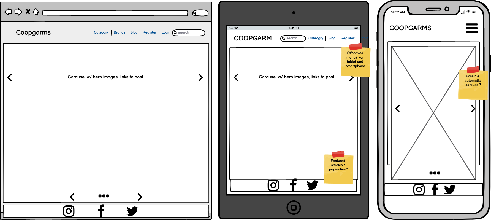

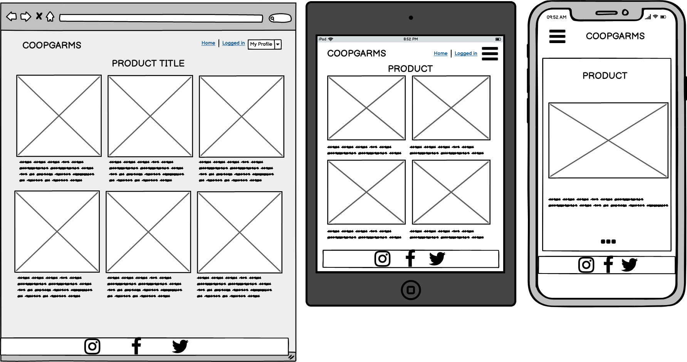

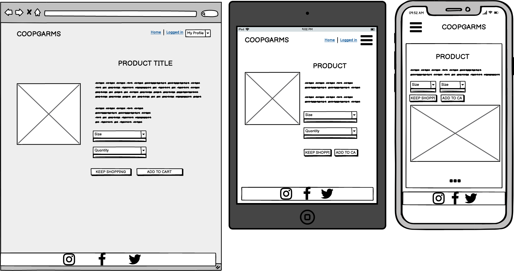

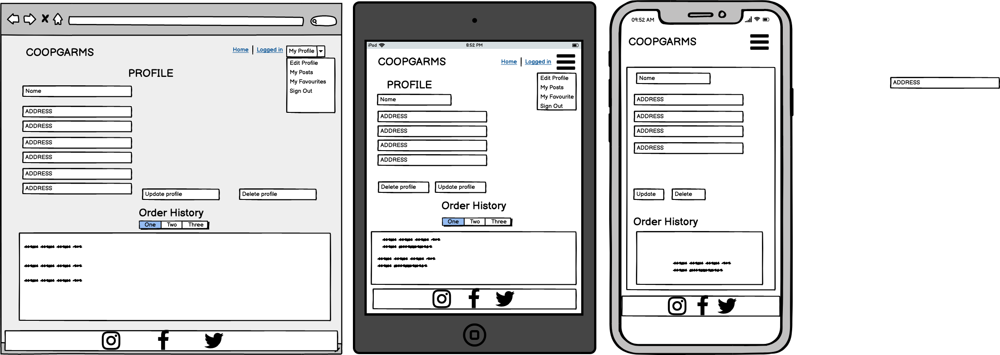
    
</details>


#### Database Schema

Custom Profile, Post and Comment models were built on top of the default Django User model, utilising Django's AllAuth to look after the user authentication. As AllAuth works with the generic User model, the Profile model was created to look after some custom fields that were not accounted for. I used [LucidChart](https://lucid.app/) to draw out the schema, listing all the relevant types to each requirement. As the schema was relatively simple, the use of foreign keys only became necessary with the author and post fields in the Post and Comment models respectively. 

<details>
<summary>Click to expand</summary>

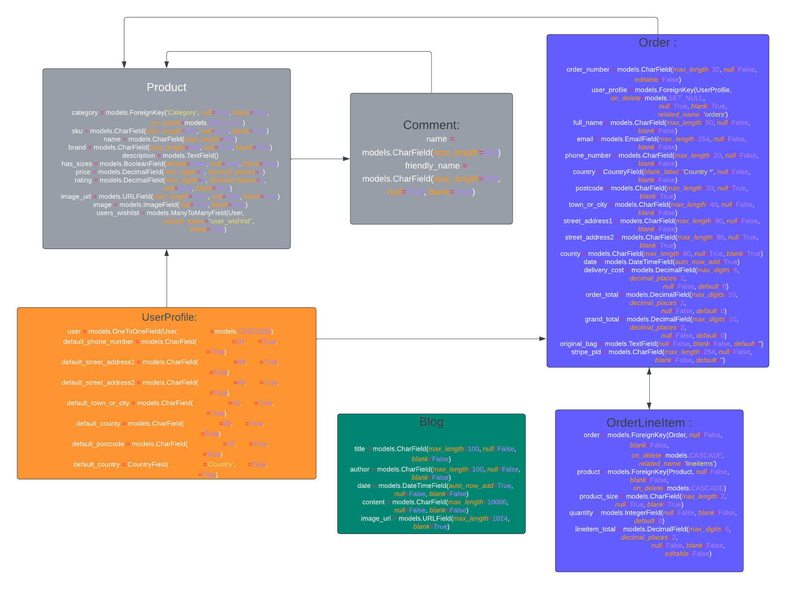

</details>
### The Surface Plane

#### Design

Once happy with the initial layout of the site, I focussed on it's design, looking for something urban, yet clean that would be provide an experience. The logo was created in [Canva](https://canva.com) and this led me towards the colour palette I decided upon:

<details>
<summary>Expand</summary>

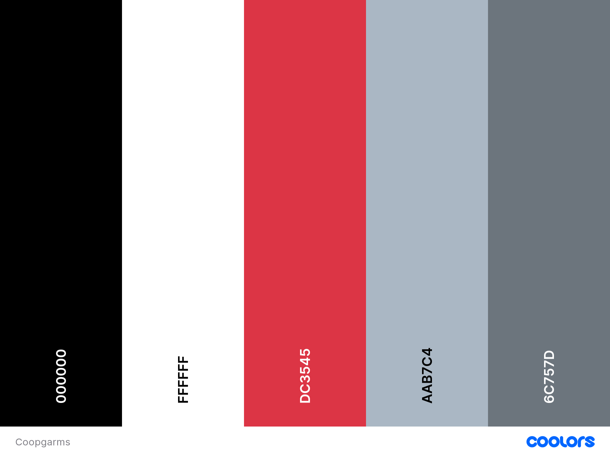

</details>

The palette was then ran through the contrast checker and only those combinations that passed at AA or AAA were utilised on the site:

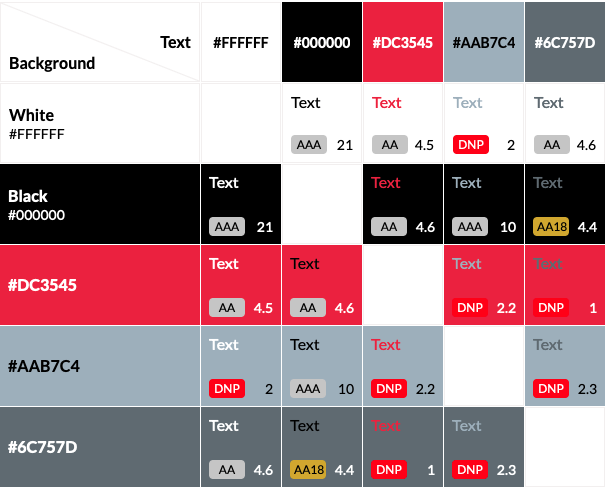


##### Typography 

Google Fonts' Roboto Condensed (Heading and body text) and sans serif (backup) were used for the fonts. 

## Features

#### Home page

#### Navigation Bar

The main navigation bar appears at the top of the page, clearly displaying the main navigational links users would require.


A user menu is available to users who are logged into the site, users who are not logged in receive a login/register link in its place. Admin would see additional options in the dropdown for blog and product management.

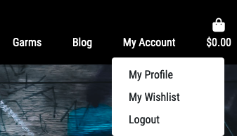

The navigation bar and the user menu are fully responsive, adapting to narrower devices by appearing from the left hand side of the screen when the menu button is pressed.


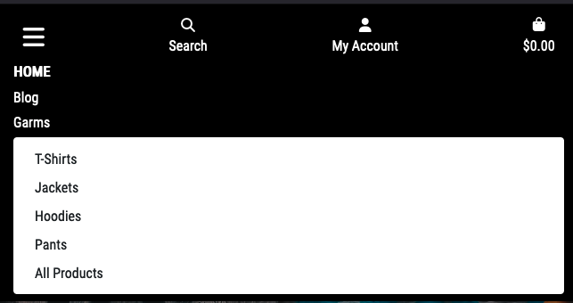

#### Footer
A common footer is utilised through out the site to encourage users to visit the social media sites of the main site. They currently direct users to the generic social media sites, all external links open in a new tab.


#### Product Card

The product card on the product page gives the title, image and item amount, along with the rating and tags. Clicking on the card will take you through to the product detail page. 

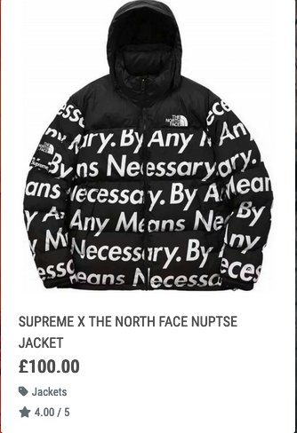

#### Product Detail

The detail view gives you an expanded view of the product with it's description along with the options to add to the wishlist, add to bag, or return to the product page. 

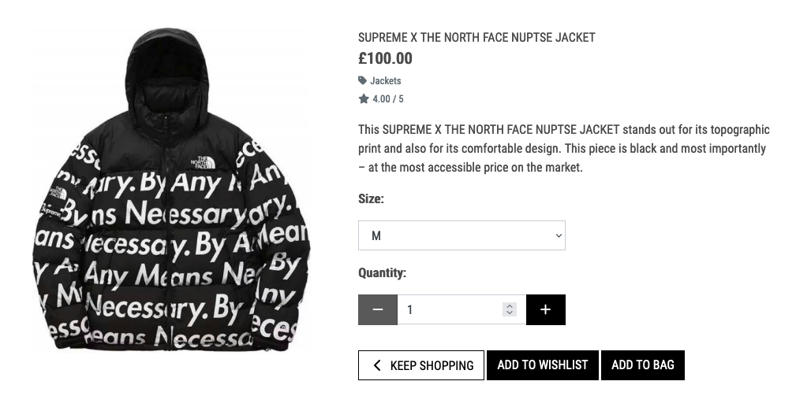

#### Wishlist

The wishlist view shows the User's saved items. This is only viewable to registered users logged-in to their account. A later implementation is to add the product directly to their cart.

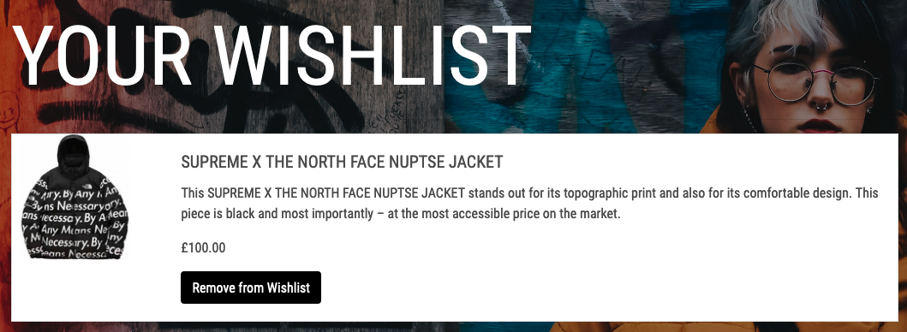

#### Cart

The cart view shows the User their items that have been added, with the option to update their quantity of the item or remove it all together. They also have the option to continue shopping, or go to the checkout to complete their order. 

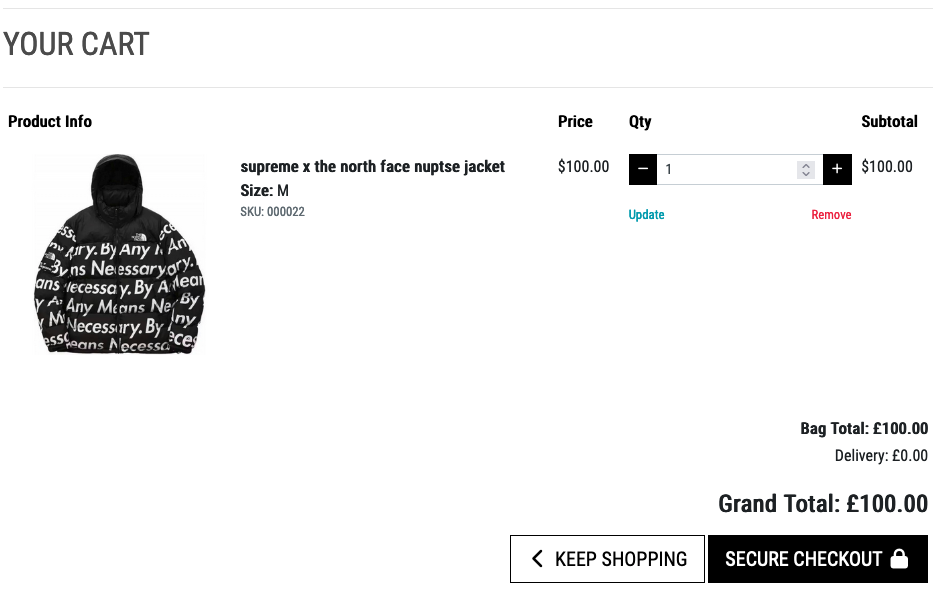

#### Checkout

This shows an order summary along with the Users address/billing details and card payment options (off image). Once the order is placed and payment confirmed, the User will be taken to the order summary page and receive an email of their order confirmation. 

#### User Profile

Users have access to their information by quickly visiting this page. This will contain their delivery/billing information that they can easily update, along with their order history, which can be expanded by clicking the order number. If a User is not logged in, they will not be able to access the page; looking up via URL will redirect them to the login page. 

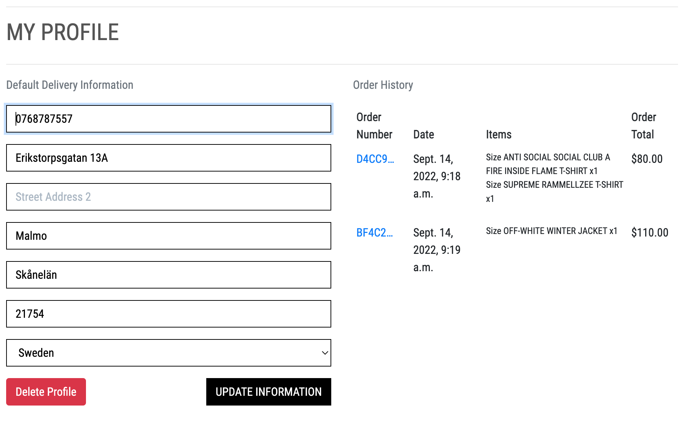

#### Blog

Anybody who visits the Site will be able to view the blog, posting about the latest streetwear news. If you are an admin, you will have the option on the page to create a new post, or edit and delete pots direct from the respective card. 

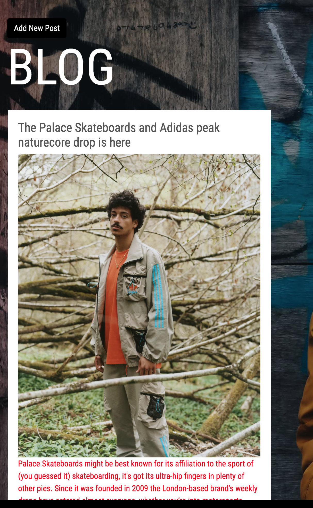

## Future Enhancements

## Testing

### Testing Strategy

A full detailed breakdown of the testing procedures and methodology can be found in the testing.md file [here](TESTING.md).
Seperate to the functionality testing of the site, and the testing of the code, User Stories were used to see if the acceptance criteria was met.

#### Testing Overview

Testing was divided into different sections to ensure everything was tested individually with test cases developed for each area.

A full detailed breakdown of the testing procedures and methodology can be found in the testing.md file [here](TESTING.md)

#### Validator Testing

All Valdiator checks passed on all custom code, excluding some frameworks. Detailed information can be found [here](TESTING.md)

#### Development bugs
  
Other than this, I believe all other bugs to be out of this site; the major issues I came across are logged in the testing file [here](TESTING.md)

#### Technologies Used

* Python
    * The following python modules were used on this project:
      ```  	asgiref==3.5.2
		backports.zoneinfo;python_version<"3.9"
		boto3==1.24.70
		botocore==1.27.70
		DateTime==4.6
		dj-database-url==1.0.0
		Django==4.1.1
		django-allauth==0.51.0
		django-countries==7.2.1
		django-crispy-forms==1.14.0
		django-storages==1.13.1
		gunicorn==20.1.0
		jmespath==1.0.1
		oauthlib==3.2.0
		Pillow==9.2.0
		psycopg2-binary==2.9.3
		PyJWT==2.4.0
		python3-openid==3.2.0
		pytz==2022.2.1
		requests-oauthlib==1.3.1
		s3transfer==0.6.0
		sqlparse==0.4.2
		stripe==4.1.0
		zope.interface==5.4.0

* Django
    * Django was used as the main python framework in the development of this project
    * Django AllAuth was utilised to provide enhanced user account management functionality.
* Heroku
    * Was used as the cloud based platform to deploy the site on
* Heroku PostgreSQL
    * Heroku PostgreSQL was used as the database for this project during development and in production.
* JavaScript
    * Custom JavaScript was used for the timeout of system messages presented.
* Bootstrap 4
    * Bootstrap was used for general layout and spacing requirements for the site.
* Font Awesome
    * Was used for access to several icons for different sections where icons were appropriate.
* AWS
    * Used for the media storage of profile and post images. 
* CSS
    * Custom css was written for areas on the site to implement custom styling.
* Jinja/Django Templating
    * Jinja/Django templating language was utilised to insert data from the database into the sites pages. It was also utilised to perform queries on different datasets.
* HTML
    * HTML was used as the base language for the templates created for the site.

#### Packages Used
* GitHub for writing the code 
* Heroku for the deployment
* Canva for the logo creation
* Balsamiq for the Wireframes
* Lucid for the database schema

#### Resources Used
* Django Documentation was invaluable throughout the development process
* Django AllAuth documentation
* [Very Academy](https://www.youtube.com/watch?v=OgA0TTKAtqQ) tutorial on creating a Wishlist in Django
* [Blvcks](https://blvcks.com/)for the product data
* [Complex](https://complex.com) and [GQ](https://gq.com) for the blog articles

## Deployment

The site was deployed via Heroku, and the live link can be found here - [Coopgarms](https://coopgarms-django.herokuapp.com/)

### Deploying to Heroku

To deploy this application to heroku first I made sure to establish a requirements.txt and Procfile as heroku needs these to operate. First into the terminal to establish the requirements.txt file enter:

```sh
pip3 freeze --local > requirements.txt
```

Then to create the Procfile:

```sh
echo web: gunicorn tippy.wsgi:application > Procfile
```

- Navigated to [Heroku](https://www.heroku.com/).
- Navigate to the dashboard and select 'New' - 'Create new app'
- Enter a unique application name and select region then click 'Create app'
- Navigate to the new apps overview page, under installed add-ons click 'configure Add-ons'. Search for 'Heroku Postgres' and select to add it to add-ons.
- To set up automatic deployment I selected 'GitHub' under the 'Deployment method' section. Then selected my github profile and the name of the repository containing my code.
- I then added my config variables to Heroku by navigating to settings, scrolling down and clicking 'Reveal Config Vars'. Then entering the key value pairs.
- I then returned to the deploy tab and selected 'Enable Automatic deployment'.
- Once the app is deployed the live site can be accessed by selecting the 'Open app' button at the top right of the page.

### Configuring Stripe

- Login to stripe
- Select the 'new business' button at the top left of the screen and enter the name.
- Navigate to the products tab and add products using the add product button.
- Navigate to the 'developers' tab in the top right then 'webhooks' in the left navigation menu.
- Select 'Add an endpoint'
- Enter the endpoint url (https://coopgarms.herokuapp.com/checkout/webhook/)
- Click 'select events' then select all events and 'Add events'.
- Select Add endpoint.
- Navigate to settings, then email under business settings.
- Turn on, 'email customers about successful payments'.
- Entered config vars to heroku for the stripe public, secret and webhook keys.
- The public and secret keys are located in the upper right section of the developers tab.
- The webhook secret is located in the business endpoint of the webhooks section of the developer tab, under signing secret.

### Configuring Gmail

- Log in to gmail.
- Navigate to settings, then select accounts and Import > other google account settings > Security > Signing into google.
- Click to turn on 2 step verification and follow instructions to verify.
- Return to the security page and select the new option 'App passwords' under signing into google.
- For app select 'Mail' and under select device select other and type 'django'.
- Copy the generated app password and save it as a config variable in heroku along with the gmail email account.
  ```
  EMAIL_HOST_PASS: generatedAppPassword
  EMAIL_HOST_USER: example@gmail.com
  ```

#### Forking the repository
By forking the GitHub Repository you can make a copy of the original repository to view or change without it effecting the original repository
This can be done by
    - Log into GitHub or create an account.
    - Locate the repository at [Coopgrams](https://github.com/mattcooperdev/coopgarms)
    - At the top of the repository, on the right side of the page, select "Fork" from the buttons available.
    - A copy of the repository should now be created in your own repository.

#### Create a clone of this repository
Creating a clone enables you to make a copy of the repository at that point in time - this lets you run a copy of the project locally:
This can be done by:
* Navigate to https://github.com/
* click on the arrow on the green code button at the top of the list of files
* select the clone by https option and copy the URL it provides to the clipboard
* navigate to your code editor of choice and within the terminal change the directory to the location you want to clone the repository to.
* type 'git clone' and paste the https link you copied from github
* press enter and git will clone the repository to your local machine

### Acknowledgements

I'd like to thank the following:

* Antonio Rodrigues for all his help during this project.
* The Tutors at Code Institute, who are there for you at your deepest times of need. 
* My love, Mor and our incredible son, Leo, for whom I wouldn't have the drive and persistence to achieve any of this. 
