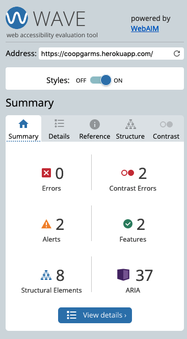
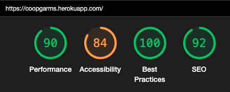

# Manuel Testing
* [Manuel Testing](#manuel-testing)
  * [Bugs and Fixes During the Development Process](#bugs-and-fixes-during-the-development-process)
* [Wave Aim Accessibility checker](#wave-aim-accessibility-checker)
* [Lighthouse](#lighthouse)
* [Validators](#validators)
  * [HTML:](#html)
  * [CSS:](#css)
  * [JS:](#js)
  * [PEP8:](#pep8)
* [Manual testing](#manual-testing)
  * [As an Admin I can...](#as-an-admin-i-can)
  * [As an Unregistered User I can...](#as-an-unregistered-user-i-can)
  * [As a Registered User I can...](#as-a-registered-user-i-can)

## Bugs and Fixes During the Development Process

* Issue - Receving 404 error when trying to access Wishlist 
* Fix - In wishlist view the render return was incorrectly indented. Amending this resolved the issue and user validation was restored.

* Issue - Order not rendering on bag page.
* Fix - When creating the snippets for the bag templates, a mssing closing bracket on p element caused the whole page to not render. Adding this resolved the issue.

* Issue - Stripe payment div not rendering
* Fix - Directory for stripe elements Js file was in the wrong place, showing further down the tree as expected. Moving the directory up one branch resolved the issue.

* Issue - Missing logo in nav in certain pages
* Fix - The url used was only looking up one directory (with the help of ```../``` but when going deeper into urls this would not suffice. Using Django's in-built ```{MEDIA_URL}``` before the file name resolved the issue.

One issue that is still outstanding is the issue of a floating footer on some pages. With using bootstrap 4 a sitcky footer is possible, but die to layout schematic on some of the pages this cut off some important elements. It was too late into development to move to Bootstrap 5, where the footer classes are more reliable, in fear of breaking other parts of the layout, so it is a grievance that is still there. I will strive to resolve the issue as I continue to work on the Site. 


# Wave Aim Accessibility checker:
* Their is some low contrast warning in the report due to the use of an overlay on some of the pages. This overlay is hidden at site laod so I do not see it as a concern. The WAVE report now comes back clear of all major errors. 
<details>
<summary>Expand</summary>

   

</details>

# Lighthouse
The lighthouse test showed varying performance scores on each page on the site due to the varying amounts of media used over each page. Using tinypng to compress uploaded images improved load time dramatically. 

In general Mobile scores were lower in performance for two main reasons, cdn imports from bootstrap, jquery, and the already compressed (multiple times hero images). As a future development, I would be firstly looking to reduce load time by replacing the few lines of jquery in my custom JS file with vanilla JS instead, and secondly I would change the hero image to be imported with CSS so the second hero image (default to display: none) didn't slow down the page load time.

<details>
<summary>Expand</summary>

  

</details>


# Validators
## [HTML](https://validator.w3.org):

One error stands in the lack of some list elements in the navbar not belonging to either an ```<ol>``` or ```<ul>```. This was due to it causing styling issues late into deployment and the time wasn't there to change. All other errors are cleared. 

## [CSS](https://jigsaw.w3.org/css-validator/):
Checking by URL there were a lot of errors coming from the bootstrap and font awesome source code.  However my CSS file was tested by direct upload was found to be free from errors
Valid CSS!
<p>
    <a href="https://jigsaw.w3.org/css-validator/check/referer">
        
    </a>
</p>


## [JS](https://jshint.com/):
All custom JS was found without errors. 

## [PEP8](http://pep8online.com): 
The only error I found was in settings.py with ``` AUTH_PASSWORD_VALIDATORS ``` & ``` STATICFILES_STORAGE ```.   


Django seems to think shortening these lines is ill advisable. For this reason, I left them to be longer than 80 characters. 

# Manual testing
Below is a summary of how I manually tested each user story.

## As an **Admin** I can...

| Checked | ...**gain access to admin-only links** |
|:-------:|:--------|
| &check; | Can create products and blog posts from the front-end links |

| Checked | ...**Log into a user interface** so that **I can easily manage data via a user interface** |
|:-------:|:--------|
| &check; | Can Log in to admin panel successfully |
| &check; | Changes to any data are reflected in the database |

| Checked | ... **Filter and search all custom models from the admin page** so that **I can utilize the admin page to review, edit and delete data quickly.** |
|:-------:|:--------|
| **Products** |  |
| &check; | Can search product by name |
| &check; | Can search product by brand |
| &check; | Can filter by price |
|:-------:|:--------|
| **Orders** |  |
| &check; | Can search order by user |
| &check; | Can search order by date |


| Checked | ...**Create new blog posts** so that **I can keep the Site up to date with the latest streetwear fashion news.** |
|:-------:|:--------|
| &check; | Can create a post individually |
| &check; | Can edit posts |
| &check; | Can delete posts |

| Checked | ...**Delete a post** so that **I can remove posts that are no longer relevant to the site.** |
|:-------:|:--------|
| &check; | Can delete from the admin panel |
| &check; | Can change status to remove post for review |
| &check; | Deletion is reflected in the database |


## As an **Unregistered User** I can...

| Checked | ...**quickly determine the subject of the site** so that **from the landing page, I can see if I want to continue spending my time on this site and register** |
|:-------:|:--------|
| &check; | Can see the theme of the site from the landing page  |
| &check; | Quickly navigate the Site to see it's content |

| Checked | ...**register for an account** so that **I can enjoy a personalized experience as a User** |
|:-------:|:--------|
| &check; | Can sign up for a new account with email  |
| &check; | Logged in and get redirected to the login page upon successful signup |
| &check; | Able to start using the site features immediately |
| &check; | New user entry visible from the database after registration |
| &check; | Unable to register with a duplicate email or username |

| Checked | ...**browse the products** so that **I can see if I wish to register to use the wishlist** |
|:-------:|:--------|
| &check; | Can see the product previews and detailed view |
| &check; | Can see I need to sign up/log in to use more features |

| Checked | ...**make a purchase** so that **I can receive the products I want** |
|:-------:|:--------|
| &check; | Can make a purchase |
| &check; | Can check validation on address and card details |
| &check; | Can check order progress |
| &check; | Notified of successful order |
| &check; | Notified of unsuccessful order |

| Checked | ...**subscribe to the newsletter** so that **I can receive news updates about the latest streetwear** |
|:-------:|:--------|
| &check; | Can access url |
| &check; | Can input email address |
| &check; | Recieve notification |


## As a **Registered User** I can... 

| Checked | ...**update an account** so that **I can save my delivery and billing information** |
|:-------:|:--------|
| &check; | Have full CRUD of account  |
| &check; | Can edit an account and it's information |
| &check; | Can delete an account and all information held |
| &check; | Check on profile information |
| &check; | Check on wishlist |
| &check; | Add item to wishlist |
| &check; | Delete item on wishlist |


| Checked | ...**See appealing colors and uniform style themes**|
|:-------:|:--------|
| &check; | Colors pass contrast test |
| &check; | Colors and styles are consistent across the site |

| Checked | ...**Access the site from any size screen and still have a pleasant experience on the site** so that **I am not restricted to which devices I can use on the site** |
|:-------:|:--------|
| &check; | Home page is responsive from 320px up |
| &check; | Post Detail is responsive from 320px up |
| &check; | Create a Post is responsive from 320px up |
| &check; | Edit a Post is responsive from 320px up |
| &check; | Register page is responsive from 320px up |
| &check; | Login page is responsive from 320px up |
| &check; | Profile page is responsive from 320px up |
| &check; | Edit Profile page is responsive from 320px up |
| &check; | Navbar is responsive from 320px up |
| &check; | Footer is responsive from 320px up |
| &check; | Edit form is responsive from 320px up |
| &check; | Sign out page is responsive from 320px up |
| &check; | 404 page is responsive from 320px up |
| &check; | 500 page is responsive from 320px up |

| Checked | ...**type a URL into the web browser** so that **I can access the site's various pages** |
|:-------:|:--------|
| &check; | All pages can be accessed by their URL when logged in |
| &check; | When logged out, only certain oages are available |
| &check; | Message displayed if a user is logged out and tries to access a URL which is denied |
| &check; | 404 page |

| Checked | ...**see uniformity on each page and clearly distinguish the content subject** so that **I can quickly and familiarly navigate the page.** |
|:-------:|:--------|
| &check; | Navbar on all pages the same |
| &check; | Footer on all pages the same |
| &check; | Styling of all pages follow a theme |


## As a **Registered User** I can...
| Checked | ...**see appropriate responses upon specific interactions with the site** so that **I know my edit, deletion, submission has been successful.**|
|:-------:|:--------|
| &check; | When updating my cart the success message shows on screen|
| &check; | When updating my address the success message shows on screen|
| &check; | When creating a profile the success message shows on screen|
| &check; | When updating a profile the success message shows on screen|
| &check; | When deleting a profile the success message shows on screen|
| &check; | When logging in the success message shows on screen|
| &check; | When logging out the success message shows on screen|
| &check; | When registering an account the success message shows on screen|

[Back to Readme](README.md)
